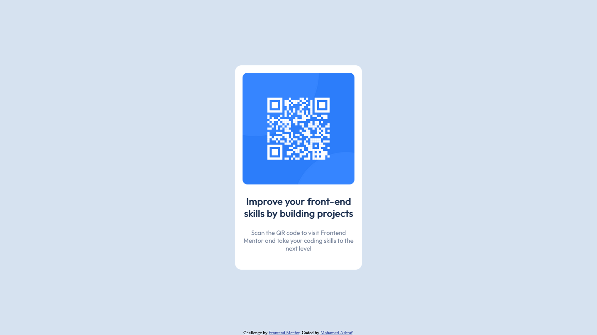

# Frontend Mentor - QR code component solution

This is a solution to the [QR code component challenge on Frontend Mentor](https://www.frontendmentor.io/challenges/qr-code-component-iux_sIO_H). Frontend Mentor challenges help you improve your coding skills by building realistic projects. 

## Table of contents

- [Overview](#overview)
  - [Screenshot](#screenshot)
  - [Links](#links)
- [My process](#my-process)
  - [Built with](#built-with)
  - [Continued development](#continued-development)
  - [Useful resources](#useful-resources)
- [Author](#author)

## Overview
A project to recreate a design for QR Code page using HTML and CSS

### Screenshot

### Links

- Solution URL: [Add solution URL here](https://github.com/MohamedAshraf27/MohamedAshraf27.github.io.git)
- Live Site URL: [Add live site URL here](https://mohamedashraf27.github.io/github)

## My process

### Built with

- Semantic HTML5 markup
- CSS custom properties
- Flexbox
- Google Fonts

### Continued development

I need to practice using Flexbox and Grid more to able to master them.

### Useful resources

- [Resource 1](https://developer.mozilla.org/en-US/) - This helped me remember anything i forgot regarding HTML or CSS.

## Author

- Frontend Mentor - [@MohamedAshraf27](https://www.frontendmentor.io/profile/MohamedAshraf27)
